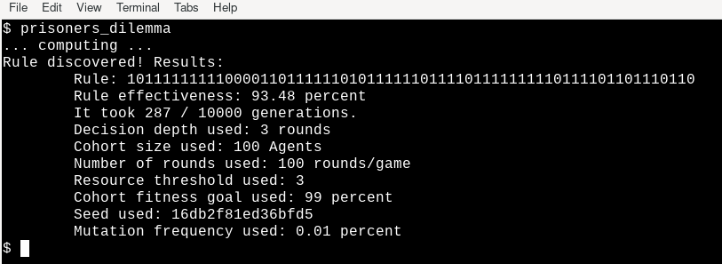
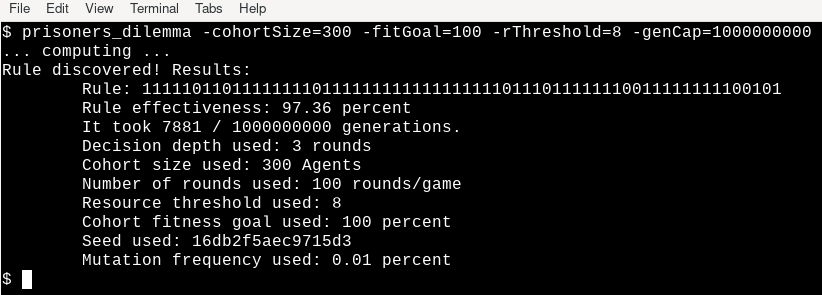

# Prisoner's Dilemma
### A Genetic Algorithms Experiment

**Description**: Not that long ago, inspired by a paper [Genetic Algorithms by John Holland](http://www2.econ.iastate.edu/tesfatsi/holland.GAIntro.htm) and also by a book written by the same author ("Signals and Boundaries"), I wrote a toy framework for exploring the problem using Kotlin, which can be found [here](https://github.com/sgibber2018/GeneticPlayground). Although that was a successful attempt, I was left wanting to try again from the ground up in order to do things a little differently. I took the opportunity to learn some Go while having another whack at the project, and I am glad I did because Go turns out to lend itself very well to this kind of thing. Kotlin is no slouch either, but I very much enjoyed using Go for this project. I am somewhat more comfortable writing this style of code than I am with Kotlin. Unlike the Kotlin version, this is a pure CLI toy with no frills. I have improved on some aspects of its performance and architecture, and this supersedes that one in pretty much every way. 

**Examples:** Here are some example images showing a couple of different results based on different parameters:

In the above example, the default settings are used. These are quick defaults chosen arbitrarily. It takes longer to test the result in this case than it does to generate it! However, it still leads to a 90%+ Rule, usually. In the near future I am going to find the optimal defaults for a given timeframe and desired fitness rating by raising the experiment one scope higher; using this program as the input for another Genetic Algorithm. 

In the above example, I gave it a fitness goal of 100%. This means that every single Agent in the Cohort has beaten a randomly generated Prisoner's Dilemma Classifier Rule that generation. This is actually possible at smaller Cohorts (such as this example, at 300). However, it can be misleading. The above example is pretty good, having won 97.36% of its test matches against 1 Million randomly generated Agents (the benchmark method I am using). Even so, it is a "local maximum" in a sense. A larger Cohort would have found it harder (or even impossible) to hit 100%. There are still more things I can do to refine the test.

**Status**: I will probably make some more improvements to this before moving on to the next project. The idea is for the `cas/` library to be usable in a variety of contexts, and Prisoner's Dilemma is a basic example. I will not move on from Prisoner's Dilemma just yet, but I plan to use these concepts to explore some other games (and also some models in some papers I found interesting) in the near future. So this was really a proof of concept, as well as an excuse to learn some Go.

**Installation**: Assuming you have Go installed, all you should need to do is clone this repository and then use `go install`. There are no external requirements, it runs in parallel, and it is fairly performant in space and time. 

**Usage**: This is really just a demo. There is not much use for it other than to run it and see what it does, in order to get a feel for what is happening. So this program is for those with a specific interest in seeing how Genetic Algorithms work. For the curious, the program basically does the following:

* The default parameters are pretty good, but they can all be tweaked. Custom seeds can be inserted with `-seed=<seed>` (although currently it does not deterministically reproduce the exact same run with the same seed, unfortunately -- a long term goal), and progress notifications can be enabled with `-notifications=1`. For a full list of tunable parameters, check out `main.go`.
    
* Creates a `Cohort` of given size, filled with a given number of `Agents`, each of whom has a `Classifier` describing a `Rule`. This `Rule` takes a `Prisoner's Dilemma` game state as input (represented by a slice of 1s and 0s), reduces the game state to an index, and then checks the "bit" (in this case a full integer but still a 1 or 0 in the slice) at that index within the player's `Rule`. Since the game only comes down to a binary choice each round ("Defect" or "Cooperate"), the whole problem space can be represented this way. In fact, even for more complicated problems they can be represented this way (for example, by using a different base or by converting a decision tree in to a binary equivalent; both of which will probably feature in future projects). Because 3 turns of depth are being considered (for now -- I will allow for arbitrarily high depth soon) that works out to a 64 "bit" `Rule`.
    
* Until the desired fitness goal is reached, the `Cohort` passes through "generations". During each generation, each `Agent` in the `Cohort` plays a randomly generated opponent. Since the search space is so large, random opponents should be very bad in general. A "game" is an iterative game of `Prisoner's Dilemma`, played over many rounds (100 by default). This step happens concurrently for best performance. 
    
* When the desired fitness goal is reached ("fitness" being defined as the percentage of a `Cohort` which can win against a random opponent), the final state of the Cohort contains a body of good `Rules`. But which is best? To find out, they each play each other and the best one is the "champion". This step also happens concurrently for best performance.

* To get as close to an objective measure of a "Champion" rule as possible, they are tested concurrently against a very large sample of random rules. Currently that is 1 Million samples, which is still a pretty small number given the size of the search space (2^64).
    
* The user is presented with some basic information about the state of the `Cohort` at the end of the simulation, and about the "champion" in the final `Cohort`. I have not implemented any serious logging, but I probably will before moving on to other projects of this nature.
   
* There is room to expand the scope of this experiment a little more, and I intend to do so. For example, testing various `Cohorts` with different parameters; or creating a pool of "champions" from many different pools and then seeing if it evolves any differently. There is more to be done here before the `cas/` library is as robust as it can be.
    
