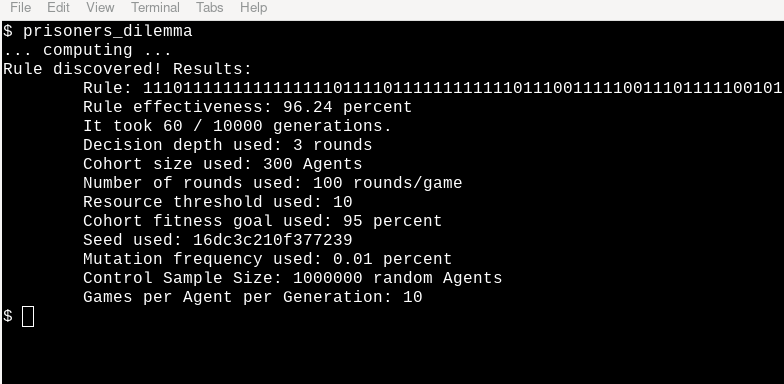
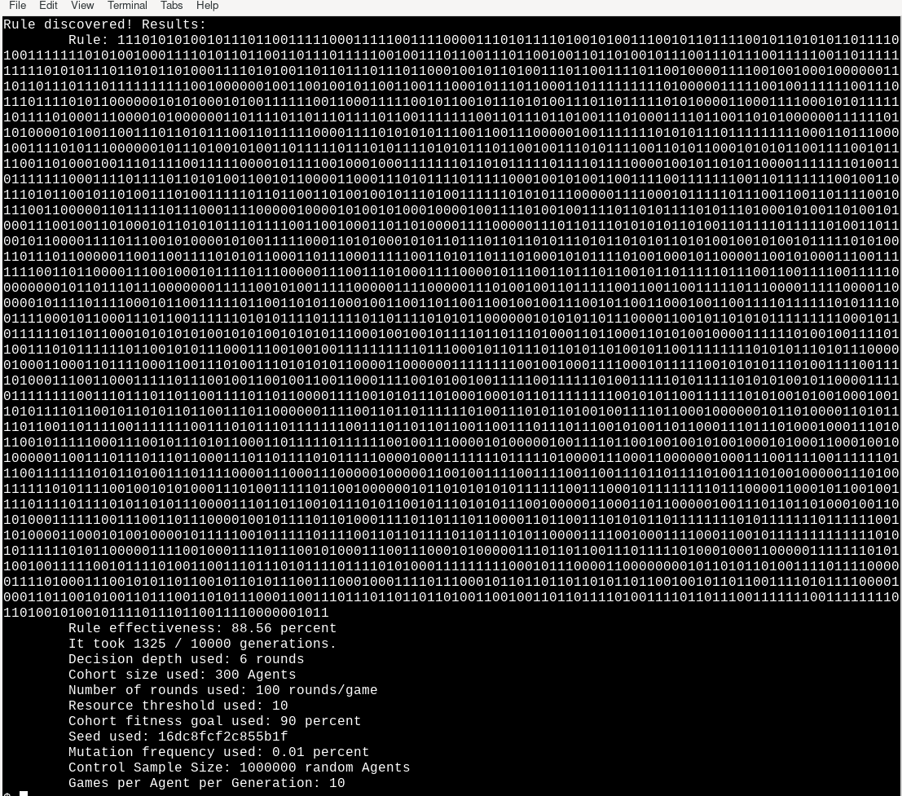

# Prisoner's Dilemma
### A Genetic Algorithms Experiment

**Description**: Not that long ago, inspired by a paper [Genetic Algorithms by John Holland](http://www2.econ.iastate.edu/tesfatsi/holland.GAIntro.htm) and also by a book written by the same author ("Signals and Boundaries"), I wrote a toy framework for exploring the problem using Kotlin, which can be found [here](https://github.com/sgibber2018/GeneticPlayground). Although that was a successful attempt, I was left wanting to try again from the ground up in order to do things a little differently. This one supersedes that one in pretty much every way. I took the opportunity to learn some Go while having another whack at the project, and I am glad I did because Go turns out to lend itself very well to this kind of thing. Kotlin is no slouch either and I will probably backport some of these improvements to that project eventually, although this one is now the superior version. This is a pure CLI toy with no frills (for now). I will probably output files which can be plugged in to graph viz software at some point in the future. 

Here is an example of the results of a run using the default parameters.

**Status**: The idea is for the `cas/` library to be usable in a variety of contexts, and Prisoner's Dilemma is a basic example. I will not move on from Prisoner's Dilemma just yet, but I plan to use these concepts to explore some other games (and also some models in some papers I found interesting) in the near future. What I will probably do is scale up this repository so that `Prisoner's Dilemma` is just one part of it. The next part will be one scope further up, testing the best parameters for `Prisoner's Dilemma` (as laid out below in a hand-tuned fashion).

**Installation**: Assuming you have Go installed, all you should need to do is clone this repository and then use `go install`. There are no external requirements, it runs in parallel, and it is fairly performant in space and time. The resulting program will be called `prisoners_dilemma`. You can also use `go build` to build an executable which can be run with `./prisoners_dilemma`. One can also use `go run .`. All of those should work. 

**Usage**: This is really just a demo. There is not much use for it other than to run it and see what it does, in order to get a feel for what is happening. So this program is for those with a specific interest in seeing how Genetic Algorithms work. In a nutshell, what this program does is it produces a `Rule` for playing `Prisoner's Dilemma`. This rule is like a `Decision Tree`, and contains all possible responses (for that `Rule` in particular) to all possible game states. This is straightforward here because `Prisoner's Dilemma` is such a simple game. It is possible to use this concept to explore much more complex games, simulations, and more. It functions by "evolving" a group of `Rules` together over time (contained within `Agents` who, in a more complex simulation, might contain multiple kinds of `Rules` for multiple kinds of sub-systems in play) in a `Cohort`, pitting them generation after generation against randomly-generated opponents and using the concept of `Genetic Algorithms` to perpetuate the most effective ones (and their variations) over time. When a certain goal is reached, the `Cohort` is tested to find the most effective `Rule` within it. This `Rule` is then tested against a large random sample, and is output as the result. See below for a full list of tunable parameters.
    
**Command Line Args / Tunable Parameters**: All of the following parameters have an effect on how the simulation runs and on the quality of the results. At the moment they are hand-tuned by trial and error to achieve a reliable effectiveness of 94 - 96%, most of the time, for the finally selected `Rule`, in a reasonable amount of time. In the near future, I will "up-scope" the simulation and use another Genetic Algorithm to determine the best parameters for this one. These parameters are intertwined and have cascading effects on each other. It is an interesting optimization problem in itself to find the best ones which produce the most effective Rule, reliably, in the shortest amount of time.

*NOTE:* None of these args have much (if any) error handling yet. Use the indicated types please to avoid errors.

* `-decisionDepth=<int>` This controls how many rounds "back" a `Prisoner's Dilemma` player will look when using the game state as input for its `Classifier Rule`. The default, suggested by John Holland in the above paper, is 3 turns (leading to a 64 "bit" `Classifier Rule` and a 64 "bit" search space in general). Note that this simulation does not use true "bits", and these are represented by Go Slices (dynamic arrays) of integers which just happen to be 1 or 0. The default of a 3 round (for each player) game state is kept track of internally via two `Queue` data structures that track the binary result of each decision to the desired depth. Combined, their contents form the complete game state. The size of this game state determines the subsequent required size of each `Classifier Rule`. As the default is 3 turns, this means that a default `Classifier Rule` is 64 "bits" long. This is derived with the formula: `2^(depth * 2)`. At `decisionDepth=6` this winds up being a 4,096 "bit" `Classifier Rule`. At `decisionDepth=8` this is a 65,536 "bit" `Classifier Rule`. Since these data structures are actually using 32-bit integers under the hood rather than true bits, this starts to add up really fast. This becomes very noticeable at `decisionDepth=5` and higher. Each `Cohort` has potentially hundreds or thousands of `Agents` each with a `Classifier Rule`. Each time an `Agent` is tested against a random opponent, that requires another `Classifier Rule` and also a game state. In order to prevent explosive space complexity growth, I put a limit on how many goroutines can run at once during crucial parts of the computation. This causes a complexity bottleneck at higher depths, as each goroutine costs much more, and therefore less are being allowed to run at once, slowing the whole computation down noticeably. Right now it is not unreasonable to use this to compute a `Rule` at `decisionDepth=6` but it takes awhile. If you are really willing to wait, then `decisionDepth=8` is possible. Beyond that, I would need to take a much deeper approach to optimization so I placed a hard cap at `decisionDepth=8` (for now). To take this further I would need to use actual bits. While this optimization is not really needed for `Prisoner's Dilemma`, it would definitely be useful for the Genetic Algorithm which optimizes this one, so I will continue to improve this part. `Prisoner's Dilemma`'s depth requirement is relative, and a 64 "bit" search space is more than sufficient to prove the point. The Genetic Algorithm which optimizes this one, however, might benefit from a much larger search space and better optimization. Interestingly, the number of generations required is **not** impacted as much as I would have thought by increased depth. It does take a little longer to hone in on the result in larger search spaces, but not that much. The increased time taken at very high depths is mostly caused by mitigating the space complexity, with some additional fault going to the need for a larger `controlSampleSize=<int>` than the default for higher `decisionDepth=<int>` values if one wants the most accurate results. This goes to show that Genetic Algorithms can be used to search arbitrarily large spaces, in theory. See the very bottom of the page for an example of the output when `decisionDepth=6`.

* `-cohortSize=<int>` determines the size of the single `Cohort` used during the simulation. This has an enormous effect on the way the simulation runs and on its ability to navigate the search space. Currently, 300 is a good balance between speed and "spread". But this is highly dependent on the way I've structured things and that could change from update to update.

* `-numRounds=<int>` determines how many rounds will be played by two players during an iterative game of `Prisoner's Dilemma`. Currently the default is 100. Increasing this causes the simulation to take somewhat longer and somewhat improves the result. Lowering it has the inverse effect. More testing is required to determine the most efficient value for this parameter in relation to the others.

* `-rThreshold=<int>` determines how many `Resources` an `Agent` needs to reproduce after a generation. `Agents` in this sim can only get `Resources` in one way: by winning a game of `Prisoner's Dilemma` against a randomly generated `Agent`. I have found that matching this to `-gamesPerGen=<int>` leads to a pleasing progression, but there's room for optimization here. More complex `Agents` being used for more complex simulations might have multiple types of `Resources`, where there is only one `Resource` type here.

* `-genCap=<int>` determines how many generations the program will run for before calling a halt to the simulation. This is useful because it is not always possible to know how long it will take for a given fitness goal to be reached. A `Cohort` may hover just under the desired goal for hundreds of generations when it is set very high (especially in conjunction with a high `Cohort` size and/or a high mutation frequency). This is sort of like the "fuel" for the "engine" to use a different metaphor that I have come across in other programming contexts. 

* `-fitGoal=<int>` determines what `Cohort` fitness level is required for the genetic algorithm to consider its goal reached. "Fitness" is currently defined as the combined win/loss percentage of the whole `Cohort` that generation against randomly generated `Agents` (each with randomly generated `Rules`). The granularity of this metric is determined largely by the `-gamesPerGen=<int>` parameter. The default is currently 95, but it can be increased if one is willing to wait longer. Setting it to 99 or 100 is possible but given the random starting state and the size of the search space, this is not a given (and can be influenced by the other parameters), so I recomment using a lower '-`genCap=<int>` if you try higher values here. The default was chosen because it can often hone in on that target area without getting stuck for very long on the way (but it does happen), but to get the best `Rule` possible it is worthwhile to set the fitness goal higher and let the algorithm chew on it for awhile. The final few percentage points can be found in a more optimized way, which I will explore further.

* `-seed=<int>` does nothing at the moment. It was perhaps naive for me to think that it would be that easy to make this a seed-driven process. Right now one can input a seed (or don't -- it'll use the system time otherwise so there is always one used) but it does not deterministically reproduce the simulation step-for-step every time (rendering the parameter moot). I'm not sure if it is even *possible* for this kind of algorithm to be totally deterministic. I am very interested in digging deeper here. If it is possible then I'll make it so, but if not then I'll remove this parameter. Any seed input here is converted to int64 during program startup.

* `-notifications=<int>` determines updates during `DiscoverPdRule()`. Any value but -1 will update the user with information on `Cohort` fitness each generation, and on the stages of computation. This is useful for gauging how the parameters influence the speed of the computation. Note that this does add some slight computational overhead as many functions contain conditional branches which do small calculations and print to `stdout` if notifications are enabled. Note that some of these notifications are happening concurrently and so may appear out of order.

* `-mutationFrequency=<int>` determines the random chance of mutation per "bit" on each `Classifier Rule` after each generation. A new `Rule` has a 1/`-mutationFrequency=<int>` chance (by default 1/10,000) of each "bit" in the rule flipping to its opposite after being combined. Lowering this causes the `Cohort` to sample a larger search space more quickly, but makes it harder to hone in on the final few percentage points of improvement. Increasing it makes the `Cohort` more likely to get stuck in local maximums, but also more able to retain its shape once it has found a good body of `Rules`. The default is not bad, but there's room for more testing here.

* `-controlSampleSize=<int>` determines the size of the benchmark sample used to determine the final effectiveness of the `Rule` chosen by `DiscoverPdRule()`. The current default is 1,000,000, which doesn't take too long and produces a fairly consistent result. For higher values of `decisionDepth=<int>` it may be a good idea to increase this beyond the default.

* `-gamesPerGen=<int>` determines how many games of `Prisoner's Dilemma` each `Agent` in the `Cohort` plays each generation. Each game is an iterative game of `Prisoner's Dilemma` which lasts for `-numRounds=<int>` rounds, against a randomly-generated `Agent` with a randomly-generated `Classifier Rule`. Most randomly-generated `Agents` are very bad. This metric is important for determining the granularity of the fitness test used on the whole `Cohort` each generation. The default is 10, and lowering it too much can cause the algorithm to be less accurate. Increasing it further may cause it to be more accurate. This parameter has a significant effect on the time complexity of the program. I have found that matching this to `-rThreshold=<int>` leads to a pleasing progression.

**Extra**: Here is an extended example of the program running with `-decisionDepth=<int>` set to 6. Note that the `Classifier Rule` is now 4096 "bits" in size, which adds up a lot when each "bit" is actually a 32-bit integer! Although it does take longer and the final result is slightly less accurate for the same `controlSampleSize=<int>`, it still works very well at this level and can go even further if optimized for it.

